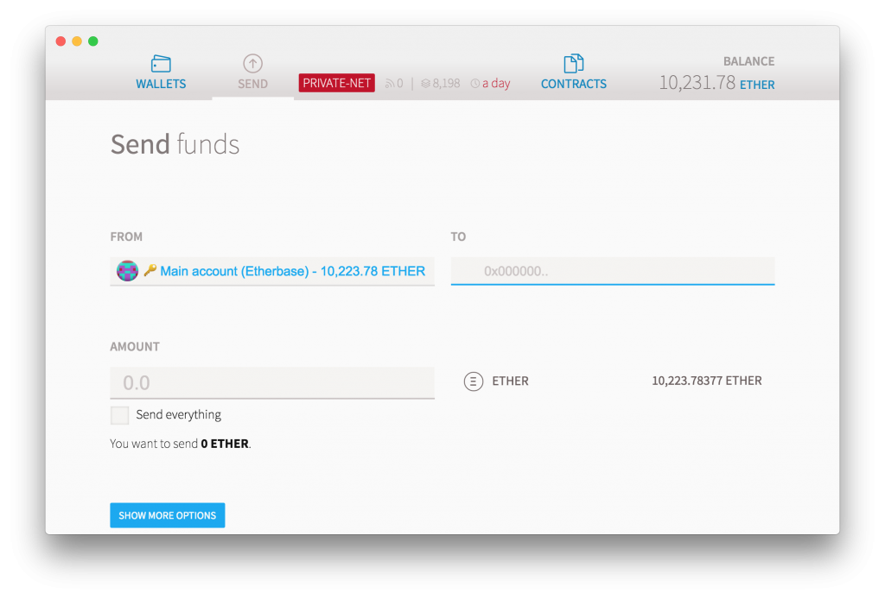

So, you want to get started with [Ethereum][ethereum]? I found that when experimenting with blockchain as a developer it’s best, to setup your own private mini blockchain. I will do this steps on MacOS, depending on your operating system, some of the steps could be different for you.

The first step is in installing the Geth command line tool on your computer. Geth is a tool, that allows you to manage your local Geth installation and run your own Ethereum node.

For Mac users it’s a good to choose the Homebrew installation. It’s brings along everything you need. For other systems, you can find the very simple instructions here [ethereum-cli]

```shell
brew update
brew upgrade
brew tap ethereum/ethereum
brew install ethereum
```

After that, you should install the Ethereum Wallet to interact with the Ethereum network. You can simply download the Ethereum Wallet from the Github Releases page. [ethereum-mist]

The Wallet will run a Geth node in the Background, and interact with this node via a socket based RPC mechanis. After you installed and started the Wallet it will ask you to create your Key Pair. This is your identity on the blockchain. The Wallet will automatically try to connect with the public Ethereum network. Note down your Blockchain address, we will need this in the follow steps. We will quit the Wallet for now, because we want to run our own network and don’t want to run on the public Ethereum network.

For that, you have to go to the command line. And create a folder called datadir. This folder will be used by our Geth node for storing all the data. Next thing we have to do, is to create a genesis.json file. This file contains the information for the Genesis Block. Which means the first Block of our Blockchain. Because we don’t want to start poor in our Blockchain tests, we maybe want to mint some money. The content of the genesis.file should look like this:

```json
{
	"config": {
		"homesteadBlock": 10
	},
	"nonce": "0",
	"difficulty": "0x20000",
	"mixhash": "0x00000000000000000000000000000000000000647572616c65787365646c6578",
	"coinbase": "0x0000000000000000000000000000000000000000",
	"timestamp": "0x00",
	"parentHash": "0x0000000000000000000000000000000000000000000000000000000000000000",
	"extraData": "0x",
	"gasLimit": "0x2FEFD8",
	"alloc": {
		"address of your wallet with leading 0x": {
			"balance": "20000000000000000000"
		}
	}
}
```

The next step is to use this genesis file to init the genesis block on your node. To do this, execute the following command on the console:

```
geth --datadir "<location of your datadir>" init <path to genesis file>
```

Now you can start your private Geth node with the following command (please replace the location of your data dir and the ethereum folder):

```shell
 geth --datadir "<location of your datadir>" \\ 
--networkid 9 \\
--port "30303" --nodiscover --autodag \\
--rpc --rpcport "8545" --rpccorsdomain "*"--rpcaddr "0.0.0.0" \\
--ipcpath <path to ethereum folder>/geth.ipc \\
console<
```

Let’s dissect this command.
–datadir provides the location of the data dir, that holds the local Blockhain copy
–networkid identifies the network we want to connect to, has to be the same on all the nodes. should be greater than 3 due to public Ethereum networks using 1 and 3
–port defines the port through which this node can communicate with other Geth nodes
–nodiscover we don’t want our node to be automatically detected by other nodes
–autodag enable automatic DAG pregeneration
–rpc and following defines the JSON-RPC accessibility of our node
–ipcpath defines the path for the IPC file, this is important, so we can use the Ethereum Wallet as a UI
console start the node with a foreground console so we can easily interact with

Location of the Ethereum IPC folder on other platforms:

| OS      | Location                   |
|---------|----------------------------|
| OS X    | ~/Library/Ethereum/        |
| Linux   | ~/.ethereum/               |
| Windows | ~/AppData/Roaming/Ethereum |
 
Okay, so we now have started our very first Ethereum node, and you should see a command prompt.

To check if your node is working correctly, you can for example use

```javascript
eth.accounts
```

to get an array of all the addresses installed with your Geth node.

```javascript
["0xd4bf167a7f595d3c4d1502dd82408eabe96b7ff3", 
"0x68d40b98b247cdda1ac6c44870fce3dce91571ae", 
"0xb190456d0078f47c5cb9ea3701de9c6a9cdb3e44"]
```

If you want to check the balance of a address you can simply use:

```javascript
web3.fromWei(eth.getBalance("<address>"), "ether");
```

Now let’s start the Ethereum Wallet again. After login you should see something like this:


*Your Ethereum wallet wih the current balance*

You can create new accounts with the Add Account button. Do this now to create a second account under your Key Pair. Copy the address of your new account and press the send button at the top.


*Your wallet when sending ether*

Set the To field to the address of your newly created account. And for example set the amount to 10 Ether. And confirm the transaction. But what’s that? The Ether is not showing up in your new account. What happened?

Well, there is no miner running on our network yet, that generates new blocks. We set a pretty low difficulty for generating new blocks, which allows any node to generate new blocks without too much hassle.

We can start mining of new blocks on our local node by simply executing the following command in the console window:

```javascript
web3.miner.start()
```

Because we don’t want to generate millions of blocks without transactions, we should stop mining of new blocks afterwards.

```javascript
web3.miner.stop()
```

That’s it. We created our private blockchain. If you want to add nodes to your network, you can follow the steps from above. Create a second folder datadir2 and copy the genesis file to it. You will also need the enode url from your originally created first Geth node. Go back to the console window of your Geth node and execute the following command:

```javascript
admin.nodeInfo.enode
```

This will output the enode url, that contains the following information:

```javascript
enode://nodekey@ip:port
```

For a second node, we first have to init the genesis block of our chain, and then we can start our node. Pass this in the commands to start a your second Geth node:

```javascript
geth --datadir "<location of your datadir2>" init <path to genesis file>;
```

That’s it, now you have a multi-node Ethereum cluster.

Edit: Forgot to put in the geth init step for the chain initalization

[ethereum]: https://www.ethereum.org/
[ethereum-cli]: https://www.ethereum.org/cli
[ethereum-mist]: https://github.com/ethereum/mist/releases