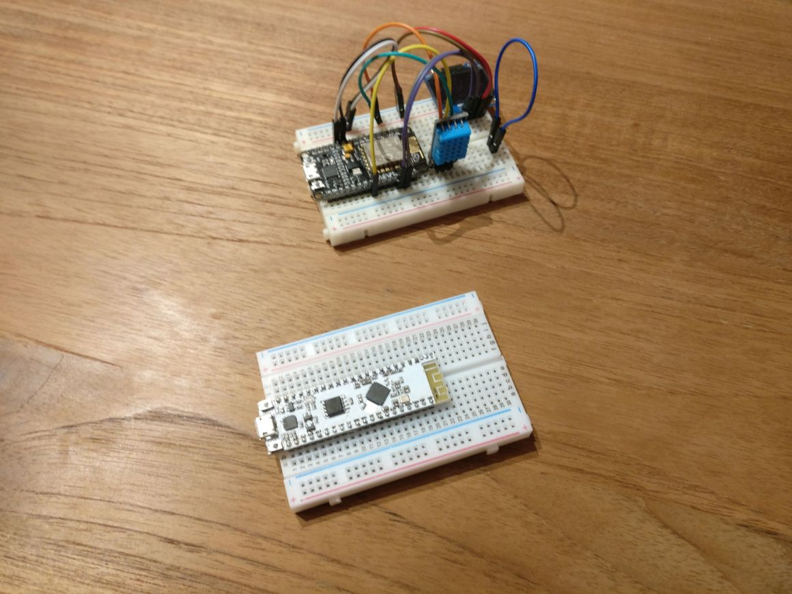

Today I got my first set of ESP 32 boards from AliExpress, and they are a beauty. If you don’t know the ESP32 yet, it’s the successor of the ESP8266 from Espressif Systems which is a love child of the IoT prototyping community.


*My new ESP32 board from Widora with his older brother the ESP8266 based NodeMCU in the background*

My new ESP32 board from Widora with his older brother the ESP8266 based NodeMCU in the background
The specs are amazing, it seems Espressif took everything the community love about the ESP8266 and fixed many of disadvantages. The following table (content from wikipedia.org, compares them quite nicely)

 Item       | ESP8266                                                                                                                                                                            | ESP32                                                                                                                                                                                                                                                                                                                                                                                                                                                                                                                       
------------|------------------------------------------------------------------------------------------------------------------------------------------------------------------------------------|-----------------------------------------------------------------------------------------------------------------------------------------------------------------------------------------------------------------------------------------------------------------------------------------------------------------------------------------------------------------------------------------------------------------------------------------------------------------------------------------------------------------------------
 CPU        | 32 Bit, 80Mhz, Single Core                                                                                                                                                         | 32 Bit, 160 or 240 MhZ, Dual Core                                                                                                                                                                                                                                                                                                                                                                                                                                                                                           
 Wifi       | 802\.11 b/g/n                                                                                                                                                                      | 802\.11 b/g/n                                                                                                                                                                                                                                                                                                                                                                                                                                                                                                               
 Bluetooth  | –                                                                                                                                                                                  | 4\.2 \+ BLE                                                                                                                                                                                                                                                                                                                                                                                                                                                                                                                 
 ADC        | 10 Bit                                                                                                                                                                             |  12 Bit                                                                                                                                                                                                                                                                                                                                                                                                                                                                                                                     
 Peripherie | 16 GPIO pins, SPI, I²C \(software implementation\), I²S interfaces with DMA \(sharing pins with GPIO\), UART on dedicated pins, plus a transmit\-only UART can be enabled on GPIO2 | 12\-bit SAR ADC up to 18 channels, 2 × 8\-bit DACs, 10 × touch sensors \(capacitive sensing GPIOs\), Temperature sensor, 4 × SPI, 2 × I²S interfaces, 2 × I²C interfaces, 3 × UART, SD/SDIO/CE\-ATA/MMC/eMMC host controller, SDIO/SPI slave controller, Ethernet MAC interface with dedicated DMA and IEEE 1588 Precision Time Protocol support, CAN bus 2\.0, Infrared remote controller \(TX/RX, up to 8 channels\), Motor PWM, LED PWM \(up to 16 channels\), Hall effect sensor, Ultra low power analog pre\-amplifier 
 Other      |                                                                                                                                                                                    | Ultra low power \(ULP\) co\-processor, Wakeup from Interrupt, Cryptographic hardware acceleration: AES, SHA\-2, RSA, elliptic curve cryptography \(ECC\), random number generator \(RNG\)…                                                        

The Espressif IoT Development Framework (Link) includes FreeRTOS, and you can conveniently use it from the Arduino ID. Simply create and delete FreeRTOS tasks using the well known commands.

```c
void setup() {
  Serial.begin(115200);
  xTaskCreate(readSensor, "ReadSensorTask", 10000, NULL, 1, NULL);
}

void loop() {
  delay(2000);
}

void readSensor( void * parameter ) {
    int i = 0;
    while(true){
      char buffer [50];
      sprintf (buffer, "Hello From Task %d", i++ );
      Serial.write(buffer);
      delay(1000);
    }
}
```

The first parameter of the [xTaskCreate][xTaskCreate Documentation] function takes the pointer to the function that implements this task. The second parameter is the task name, the name can be used for debugging, but could also be used for retrieving a task handle. The third parameter is the stack size that should be allocated for this task, determining the stack size can be a challenging task [Link][FreeRTOS Stack Size]. The fourth parameter is a value that is passed to the task as a parameter. The fifth task is the priority of the task. The sixth parameter can be passed in to obtain a handle on the task directly.

With this simple setup, you can have a separate task running in the background reading for example the ADC and posting the result to a BLE characteristic. Isn’t that cool?


[xTaskCreate Documentation]: https://www.freertos.org/a00125.html
[FreeRTOS Stack Size]: https://www.freertos.org/FAQMem.html#StackSize.