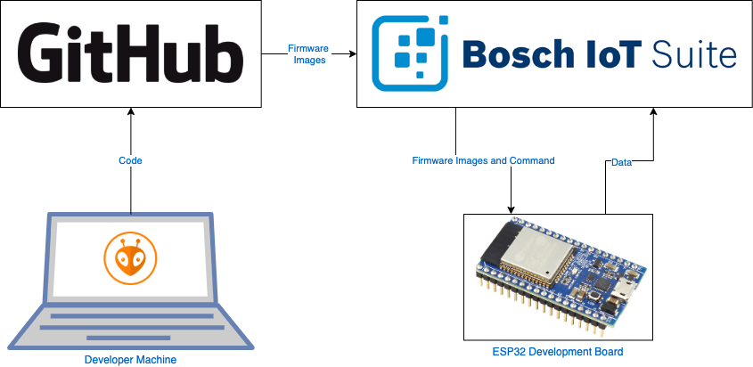

Continuous Integration and Delivery is a practice that is normally associated with development of web applications and mobile applications. When discussing embedded development this is not normally done. There is of course the risk of bricking a device due to the lack of sandboxing on constrained hardware, or that you have specific hardware needs. Even a working recovery flow, is seldomly available.
Of course new apporaches like MicroPython provide novel capabilities, but the risk of rendering a device connection less is still there.

In this blog post, we are going to ignore all of this, I want to show you the technical steps that you need to do today to use CI/CD for updating ESP32 based devices.

I am going to split this blog post into multiple parts. First I am going to give you an overview of what we want to achieve, and then we are going to work step by step on building the solution.

## The High-Level View
I am going to use platfom.io for building our firmware. It's an open-source "professional collaborative platform for embedded development". It already has a good tooling ecosystem in place, and solves many needs like testing and dependency management in a contemporary fashion.

I will use GitHub Actions to continuously integrate the firmware.

Last, but not least, I will use the Bosch IoT Suite's Device Management Package to deliver the firmware to the devices.

*The components used for this experiment*

When doing CI/CD it's always a good idea to spend some time on the Git workflow you are going to use. In contemporary software development direct commits to a main branch without code reviews, builds and tests are of course outdated. Feature development is normally solved on feature branches that are later reviewed by other developers using pull requests. Bugfixes are similarly solved on bugfix branches. Releases are only done from the main branch. Here is of course a decision possible, whether or not to have release branches or simply tag releases.

We use two different build jobs, one for building pull requests and another for continuously building releases from the main branch. They differ in regards to more extensive testing and the release publishing on the main branch.

When all test are passed as green, the firmware is automatically deployed to our Beta Fleet (which for the purpose of this blog consists of a single M5 Stack ESP32). When using this approach in a more production setting, the Beta Fleet could be devices that were passed to a friendly set of users, where also additional telemetry is collected.

You can find the complete example here: [Link][Sources]

In the next post, I am going to show you what you need to configure in Platform.IO and GitHub to build your ESP32 firmware. [Part 2 - Building ESP32 firmware using Platfom.IO and GitHub Actions][Part 2]

[Sources]: https://github.com/cgrotz/esp32-platformio-example
[Part 2]: /2020-08-24-esp32_ci_cd_part2
[Part 3]: /2020-08-25-esp32_ci_cd_part3
[Part 4]: /2020-08-26-esp32_ci_cd_part4
[Part 5]: /2020-08-31-esp32_ci_cd_part5