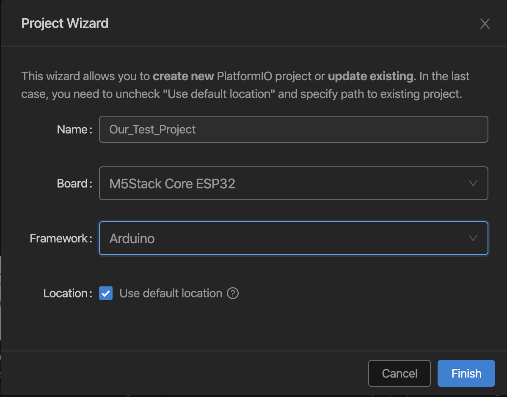
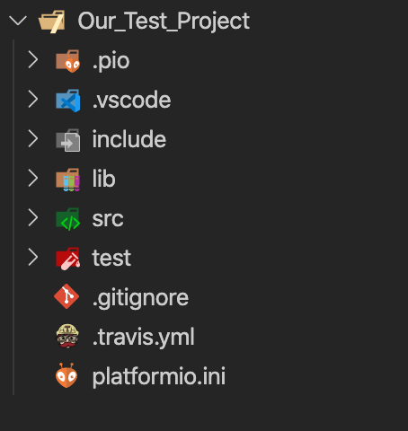
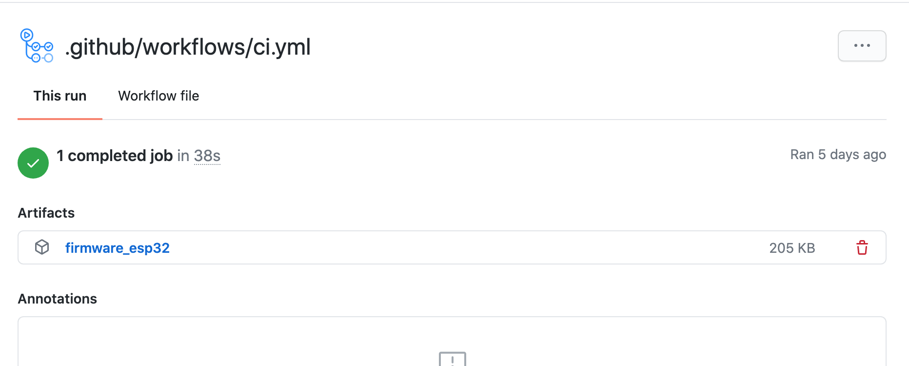

This is the second part of a multi-part blog post. You might want to start from the beginning with the [first post][Part 1].

Let's start by setting up a Platform.IO project for GitHub Actions, just create a new project in Platform.IO. Select the board you are developing against, in my case I selected the M5 Stack option.


*Platform.IOs create new project dialog*

After the creation your project structure should look similar to what you can see on the following screenshot.


*The project layout after creation*

Your platfomio.ini should look similar to this:

```ini
[env:m5stack-core-esp32]
platform = espressif32
board = m5stack-core-esp32
framework = arduino
```
*Platform.IO configuration file*

The key thing you need to look for, is the name of the environment in the above example *m5stack-core-esp32*. The firmware binary will be placed in a folder with this name later on, therefore we will need this information in order to reference the file in the build.

Create a GitHub Action workflow yml file in the *.github/workflows/* folder (you might need to create the folder). 

```yaml
on: [push]

jobs:
  build:
    runs-on: ubuntu-latest
    steps:
    - uses: actions/checkout@v1
    - name: Set up Python
      uses: actions/setup-python@v1
    - name: Install dependencies
      run: |
        python -m pip install --upgrade pip
        pip install platformio
    - name: Run PlatformIO
      run: platformio run
    - name: Attach artifact
      uses: actions/upload-artifact@v2
      with:
        name: firmware_esp32
        path: .pio/build/m5stack-core-esp32/firmware.bin
```
*.github/workflows/ci.yml*

The result of each job execution will be attached to build pipeline. You can then download the result in the GitHub actions page.


*The resulting artifact in the GitHub Actions job run*

You can find the complete example with build here: [Link][Sources]

In the next post I am going to guide you through preparing everything in the Bosch IoT Suite for distributing the firmware updates. [Part 3 - Preparing the Bosch IoT Suite][Part 3]

[Sources]: https://github.com/cgrotz/esp32-platformio-example
[Platform.IO GitHub Actions]: https://docs.platformio.org/en/latest/integration/ci/github-actions.html
[Part 3]: /2020-08-25-esp32_ci_cd_part3
[Part 1]: /2020-08-23-esp32_ci_cd_part1