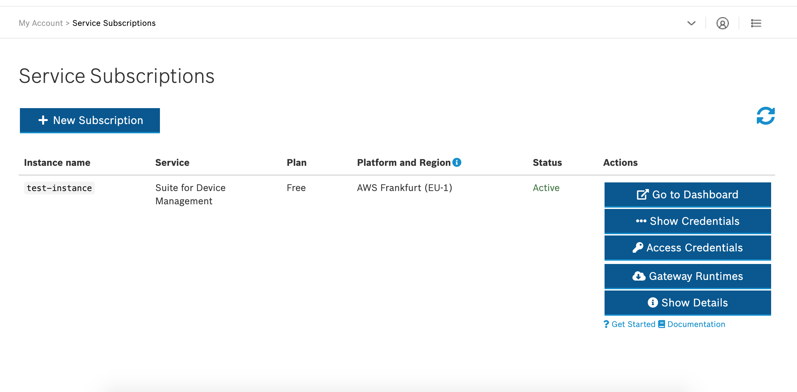
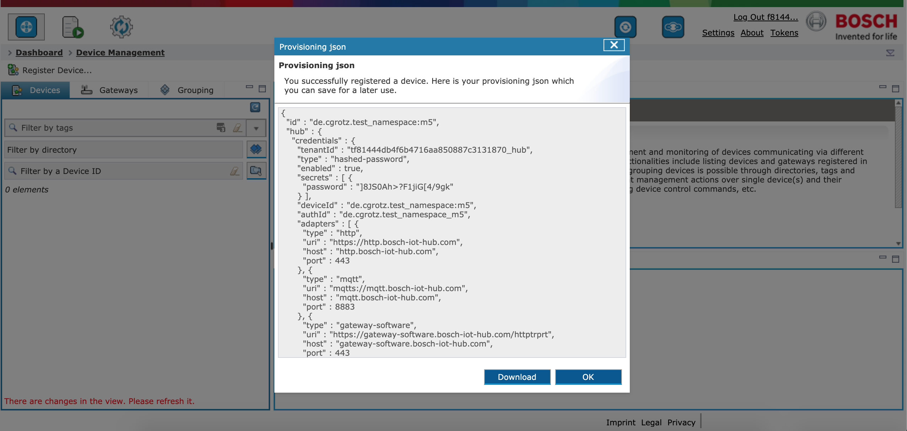

This is the third part of a multi-part blog post. You might want to start from the beginning with the [first post][Part 1].

I assume you already have logged in to the Bosch IoT Suite Console, if you haven't done this yet, you can follow this [link][Suite Portal Sign-Up] to sign up.

I am  going to use several features in the Bosch IoT Suite for facilitating the automatic distribution of the firmware build using GitHub Actions (The continuous delivery aspect). We are using tags to create a subparition of the device fleet for devices that should receive firmware updates from the CI/CD pipeline. The devices itself communicate with the Bosch IoT Suite using MQTTS, the firmware images are downloaded using a CDN with HTTPS. 

We will need to setup and configure a few specific things in the IoT Suite services.

## Booking the Device Management Package
After account creation and confirmation let's head to the [Subscriptions page][Suite Portal Subscriptions], if you have a newly created account you probably don't have a subscription yet, and your screen will look similar to the following screenshot:

*Empty subscriptions overiew after login*

*Create new subscription view*

*Select the subscription plan (at the moment only free plans are available)*

*Confirm the subscription creation*

The provisioning might take a few minutes. Afterwards you will have Bosch IoT Things, Bosch IoT Rollouts, Bosch IoT Hub and Bosch IoT Manager booked.

*DMP subscription after creation in provisioning state*

*DMP subscription after provisioning*

When clicking on "Access Credentials" you can retrieve endpoints and credentials information for the various services of the Device Management Package. Please extract the information for IoT Rollouts (Tenant, Username, Password) we are going to need them later.

*DMP subscription credentials after provisioning*

*DMP subscription credentials after provisioning, rollouts section*

Let's click on "Go to Dashboard", this will open up the IoT Manager web ui. From there click on "Things Dashboard" in the upper right corner to bring up the web ui for configuring Bosch IoT Things.

*The IoT Manager Dashboard, with the various sections. Please also take a look at the corner on the top right. There you can find shortcuts to jump into IoT Rollouts and IoT Things.*

## Configure Namespace in IoT Things
Before we can register our device and create the device shadow in IoT Things, we need to register a namespace in IoT Things. Each Thing in IoT Things belongs to a namespace, this way the things with the same serial numbers belonging to different solutions can be differentiated.

*The IoT Things dashboard after login*

Please head over to "Namespace" and register your namespace. In my example I am using the namespace "de.cgrotz.test_namespace". In the IoT Suite, thing IDs consist of a leading namespace and for example the device ID, e.g. de.cgrotz.test_namespace:device_123.

*The registered namespace*

## Create new Device
Let's go back to the IoT Manager and register our first device. After device registration IoT Manager provides a JSON config file to you, that contains everything the device needs to connect to the Bosch IoT Suite.

*The device managemnt section of IoT Manager without any devices*

*Registering a new device*

*After creating a device you are presented with a JSON data structure that contains the necessary information for connecting the device*

## Create Rollouts tag
If we later want to be able to select common devices, for example devices belonging to our beta fleet. In order to do so, the Device Managment Package has the concept of tags. Tags need to be created in IoT Manager first, and can then be assigned to devices. Tags can be queried in IoT Rollouts Target Filters for selecting Deployment Targets that for example fulfill certain requirements (e.g. the Beta Tag we just created).

*The grouping section in IoT Manager, dropdown with grouping options opened*

*The grouping section, with Tags selected*

*Create a new tag, please keep in mind that the tag ID also needs to lead with the namespace we previously created in IoT Things*

Now let's head back to the device management section and select the device we previously created

*When scrolling down in the device details, you can see tags assigned to the device*

Assign the tag we just created to your device.

*The assign tag menu*

*The device with assigned tag*

In the IoT Things dashboard you can see the change to the device shadow, that reflects the assigned tag.

*The device shadow in IoT Things, now with Beta tag assigned*

*The beta tag in IoT Rollouts with the device as update target*

## Configure IoT Rollouts

In order for the auto rollout to work without hickups (especially when testing), I needed to "allow parallel distribution of multiple distribution set assignments and rollouts". The non hacky approach would be to cancel distribution set assignments on the targets before updating the auto assignment in the target filter.

*The options in IoT Rollouts system configuration. You will need to scroll down to the end of the page for the save button.*

## Create Rollouts Target Filter
Next let's create a target filter. Target filters allow to group update targets using a filter criteria. You can assign distribution sets to target filters for automatic assignment. This means when a target matching the criteria is added it will (with some delay) automatically get's the distribution set assigned and the update process will start.

My target filter is filtering on Beta tags with the following syntax *tag==Beta*. In a production scenario I would also add a device type since we are building firmware for different target devices.

*The empty target filters overview*

*Creating a new target filter*

If you followed this steps, you should now have succesfully setuped everything you need in the Bosch IoT Suite to now connect our device.

You can go ahead with [Part 4 - Uploading and distributing the firmware using Bosch IoT Rollouts][Part 4]

[Part 4]: /2020-08-26-esp32_ci_cd_part4
[Suite Portal Sign-Up]: https://accounts.bosch-iot-suite.com/
[Suite Portal Subscriptions]: https://accounts.bosch-iot-suite.com/subscriptions
[Part 1]: /2020-08-23-esp32_ci_cd_part1