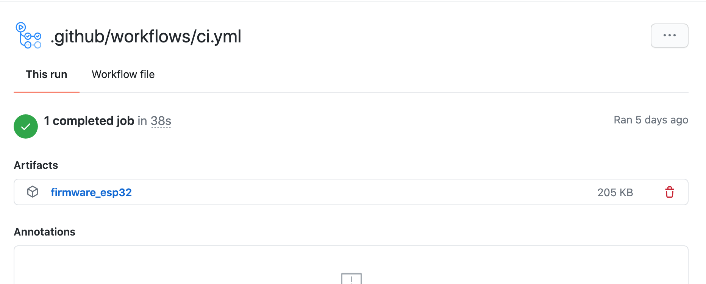

This is the fourth part of a multi-part blog post. You might want to start from the beginning with the [first post][Part 1].

Welcome back, in this part of the series we are going to connect our firmware build to Bosch IoT Rollouts. We need to add several new build steps to our GitHub Actions yaml (if you followed the example in [Part 2][Part 2] it should be placed under *.github/workflows/ci.yml*). You can find the complete example at the end of the post.

We are going to use the short form of the the GIT commit hash as version identifier for the continuous build.
```yaml
jobs:
  build:
    steps:
    - name: Extract git commit id
      id: vars
      shell: bash
      run: |
        echo "##[set-output name=branch;]$(echo ${GITHUB_REF#refs/heads/})"
        echo "::set-output name=sha_short::$(git rev-parse --short HEAD)"
```
*Extracting the GIT metadata. Thanks to aborilov for this piece of code from Stack overflow [link][stackoverflow link]*

We need to create a Software Module, to which we then can upload the artifact.
```yaml
jobs:
  build:
    steps:
    - id: create_sm
      name: Create Software Module
      uses: cgrotz/hawkbit-create-software-module-action@v4
      with:
        hawkbit-tenant: ${{ secrets.ROLLOUTS_TENANT }}
        hawkbit-username: ${{ secrets.ROLLOUTS_USERNAME }}
        hawkbit-password: ${{ secrets.ROLLOUTS_PASSWORD }}
        software-module-name: Beta Firmware
        software-module-type: Application
        software-module-version: ${{ steps.vars.outputs.sha_short }}
```
*Creating a software module*

Then we can upload the binary to the software module.
```yaml
jobs:
  build:
    steps:
    - name: Upload Artifact
      uses: cgrotz/hawkbit-upload-artifact-action@v2
      with:
        file-path: .pio/build/m5stack-core-esp32/firmware.bin
        software-module-id: ${{ steps.create_sm.outputs.software-module-id }}
        hawkbit-tenant: ${{ secrets.ROLLOUTS_TENANT }}
        hawkbit-username: ${{ secrets.ROLLOUTS_USERNAME }}
        hawkbit-password: ${{ secrets.ROLLOUTS_PASSWORD }}
```
*Uploading the firmware binary to the software module. Please be mindful of the path, this might be different if the environment in the platform.ini is named differently.*

Now we create a distribution set and assign the software module to it. This can be done in one step using IoT Rollouts.

```yaml
jobs:
  build:
    steps:
    - id: create_ds
      name: Create Distribution Set
      uses: cgrotz/hawkbit-create-distribution-set-action@v5
      with:
        hawkbit-tenant: ${{ secrets.ROLLOUTS_TENANT }}
        hawkbit-username: ${{ secrets.ROLLOUTS_USERNAME }}
        hawkbit-password: ${{ secrets.ROLLOUTS_PASSWORD }}
        distribution-set-name: Beta Firmware
        distribution-set-type: app
        distribution-set-version: ${{ steps.vars.outputs.sha_short }}
        software-module-ids: ${{ steps.create_sm.outputs.software-module-id }}
```
*Creating a new distribution set with the software moduel pre assigned*

Lastly we are assigning the distribution set to the target filter.

```yaml
jobs:
  build:
    steps:
    - name: Assign distribution set to target filter
      uses: cgrotz/hawkbit-assign-ds-to-target-filter-action@v8
      with:
        hawkbit-tenant: ${{ secrets.ROLLOUTS_TENANT }}
        hawkbit-username: ${{ secrets.ROLLOUTS_USERNAME }}
        hawkbit-password: ${{ secrets.ROLLOUTS_PASSWORD }}
        target-filter-name: Beta Filter
        target-filter-type: forced
        target-filter-weight: 200
        distribution-set-id: ${{ steps.create_ds.outputs.distribution-set-id }}
```
*Assigning the distribution set to our target filter*

You also need to setup the credentials for IoT Rollouts in GitHub. I used the build in screts mechanism of GitHub for this.


*The setup secrets in GitHub Actions*

## Complete example build pipeline
```yaml
on: [push]

jobs:
  build:
    runs-on: ubuntu-latest
    steps:
    - uses: actions/checkout@v1
    - name: Extract git commit id
      id: vars
      shell: bash
      run: |
        echo "##[set-output name=branch;]$(echo ${GITHUB_REF#refs/heads/})"
        echo "::set-output name=sha_short::$(git rev-parse --short HEAD)"
    - name: Set up Python
      uses: actions/setup-python@v1
    - name: Install dependencies
      run: |
        python -m pip install --upgrade pip
        pip install platformio
    - name: Run PlatformIO
      run: platformio run
    - name: Attach artifact
      uses: actions/upload-artifact@v2
      with:
        name: firmware_esp32
        path: .pio/build/m5stack-core-esp32/firmware.bin
    - id: create_sm
      name: Create Software Module
      uses: cgrotz/hawkbit-create-software-module-action@v4
      with:
        hawkbit-tenant: ${{ secrets.ROLLOUTS_TENANT }}
        hawkbit-username: ${{ secrets.ROLLOUTS_USERNAME }}
        hawkbit-password: ${{ secrets.ROLLOUTS_PASSWORD }}
        software-module-name: Beta Firmware
        software-module-type: Application
        software-module-version: ${{ steps.vars.outputs.sha_short }}
    - name: Upload Artifact
      uses: cgrotz/hawkbit-upload-artifact-action@v2
      with:
        file-path: .pio/build/m5stack-core-esp32/firmware.bin
        software-module-id: ${{ steps.create_sm.outputs.software-module-id }}
        hawkbit-tenant: ${{ secrets.ROLLOUTS_TENANT }}
        hawkbit-username: ${{ secrets.ROLLOUTS_USERNAME }}
        hawkbit-password: ${{ secrets.ROLLOUTS_PASSWORD }}
    - id: create_ds
      name: Create Distribution Set
      uses: cgrotz/hawkbit-create-distribution-set-action@v5
      with:
        hawkbit-tenant: ${{ secrets.ROLLOUTS_TENANT }}
        hawkbit-username: ${{ secrets.ROLLOUTS_USERNAME }}
        hawkbit-password: ${{ secrets.ROLLOUTS_PASSWORD }}
        distribution-set-name: Beta Firmware
        distribution-set-type: app
        distribution-set-version: ${{ steps.vars.outputs.sha_short }}
        software-module-ids: ${{ steps.create_sm.outputs.software-module-id }}
    - name: Assign distribution set to target filter
      uses: cgrotz/hawkbit-assign-ds-to-target-filter-action@v8
      with:
        hawkbit-tenant: ${{ secrets.ROLLOUTS_TENANT }}
        hawkbit-username: ${{ secrets.ROLLOUTS_USERNAME }}
        hawkbit-password: ${{ secrets.ROLLOUTS_PASSWORD }}
        target-filter-name: Beta Filter
        target-filter-type: forced
        target-filter-weight: 200
        distribution-set-id: ${{ steps.create_ds.outputs.distribution-set-id }}
```

You can go ahead with [Part 5 - Connecting the ESP32 to the Bosch IoT Suite][Part 5]

[Part 1]: /2020-08-23-esp32_ci_cd_part1
[Part 2]: /2020-08-24-esp32_ci_cd_part2
[Part 5]: /2020-08-31-esp32_ci_cd_part5
[stackoverflow link]: https://stackoverflow.com/a/58035262