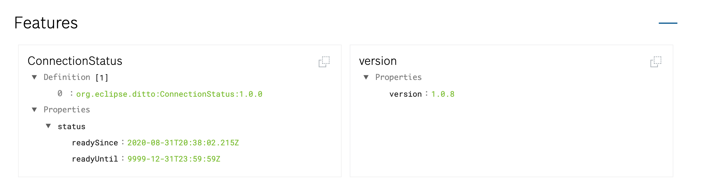

This is the fifth part of a multi-part blog post. You might want to start from the beginning with the [first post][Part 1].

In this part we beginn with connecting our device with the Bosch IoT Suite. In order to do this, we need to establish a MQTT connection to the IoT Hub. We will also update the devices device shadow in IoT Things to verify the connection.

In the [last part][Part 4], we made the necessary configuration in the IoT Suite and provisioned our device, we will need the credentials in this part. You can find the full code example at the bottom of the page.

Let's start with a basic project setup, in the following platformio.ini you can see the libraries necessary for our approach
```ini
[env:m5stack-core-esp32]
platform = espressif32
framework = arduino
board = m5stack-core-esp32
lib_deps = 
	MQTT@^2.4.7         ; The MQTT Client
	ArduinoJson@^6.16.1 ; A library for decoding the JSON messages from Bosch IoT Things
```
*platformio.ini for our project*

At the moment our main.cpp is probably rather empty and should look like the following example.
```cpp
#include <Arduino.h>

void setup() {
  // put your setup code here, to run once:
}

void loop() {
  // put your main code here, to run repeatedly:
}
```
*The starting point main.cpp*

So let's start with adding some headers for the libraries that we need.
```cpp
#include <Arduino.h> 
#include <ArduinoJson.h> // JSON Serialization and Deserialization
#include <MQTT.h> // MQTT communication
#include <WiFiClientSecure.h> // Wifi Client with TLS support 
```
What sticks out is, the *WiFiClientSecure.h* since the Bosch IoT Hub uses TLS encrypted communication we cannot just use the default WifiClient for establishing the TCP connections for accessing the MQTT connector of the IoT Hub.

Next we need to make the Wifi connection. You will need to replace the place holders with your actual wifi configuration
```cpp
void connect() {
  Serial.print("\nchecking wifi...");
  while (WiFi.status() != WL_CONNECTED) {
    Serial.print(".");
    delay(1000);
  }
  Serial.print(" connected to wifi!");
}

void setup() {
  Serial.begin(115200);
  WiFi.begin("your wifi SSID", "your wifi password");
  connect();
}

void loop() {
}
```

No that we have our Wifi connection we need to establish the MQTT connection. Let's add a *WifiClientSecure* and a *MQTTClient* to our global variables.
```cpp
WiFiClientSecure net;
// We need to increase message size since the IoT Suite messages can be rather big
MQTTClient client(2048);
```

Next steps is initalize the clients. We do this in the *connect* function we previously created.
```cpp
void connect() {
  // ...
  Serial.print("\nconnecting to mqtt...");
  client.begin("mqtt.bosch-iot-hub.com", 8883, net);

  while (!client.connect("namespace:deviceId", "namespace_deviceId@tenantId", mqttPassword, false)) {
    Serial.print(".");
    delay(1000);
  }
  // ...
}

void loop() {
  // ...
  client.loop(); // we need to call client loop in order for the mqtt client to process messages
  delay(10);  // we add a few millisecond delay for wifi stability
  if (!client.connected()) { // in case that the mqtt client is not connected anymore, we want to trigger a reconnect
    connect();
  }

  // ...
}
```

This should successfully connect the MQTT client, but how do can you tell? In the Bosch IoT Things dashboard your device should look very empty at the moment. (If you already connected it, you might see a connection status feature).

Let's send a periodic message to IoT Things from the loop method, that updates the device shadow of the device. You will need to replace *<namespace>* and *<deviceId>* with the values from your device registration.

```cpp
unsigned long lastMillis = 0;

void loop() {
  // ...
  // publish a message roughly every second.
  if (millis() - lastMillis > 1000) {
    lastMillis = millis();
    if(!client.publish("event", "{\r\n\t\"topic\": \"<namespace>/<deviceId>/things/twin/commands/modify\",\r\n\t\"path\": \"/features/version\",\r\n\t\"value\": {\r\n\t \t\"properties\": {\r\n \t\t \t\"version\": \"1.0.8\"\r\n\t\t}\r\n\t}\r\n}", false, 1)) {
      Serial.print("Failed publishing ");
      Serial.println(client.lastError());
    }
  }
  // ...
}
```

The device shadow in the Things dashboard should now be updated, and should contain a new feature called version that has a property version with the value 1.0.0.


*Device shadow with version feature*

Last but not least, we would also like to be able to receive messages from the IoT Suite. We will not use this in this post directly, but I think this post wouldn't be complete without this step.

```cpp
// add this method as a callback, for receiving new messages
void messageReceived(String &mqttTopic, String &payload) {
  StaticJsonDocument<2000> doc;
  deserializeJson(doc, payload);
  String topic = doc["topic"];
  String path = doc["path"];

  Serial.print("incoming topic: ");
  Serial.print(topic);
  Serial.print(" path: ");
  Serial.println(path);
  Serial.println("incoming: " + mqttTopic + " - " + payload);
  
  // Note: Do not use the client in the callback to publish, subscribe or
  // unsubscribe as it may cause deadlocks when other things arrive while
  // sending and receiving acknowledgments. Instead, change a global variable,
  // or push to a queue and handle it in the loop after calling `client.loop()`.
}

void connect() {
  // ... add the following line below client.begin("mqtt.bosch-iot-hub.com", 8883, net);
  client.onMessage(messageReceived);
  // ... add the following line below the client connect loop
  client.subscribe("command///req/#");
  // ...
}
```

In the *messageReceived* function, I am using ArduinoJson to extract the JSON payload. Let's have a quick look at the typical message structure Eclipse Ditto is using (on which Bosch IoT Things is build on top). There are four keys that are making the basic message frame topic, headers, path and value. Topic identifies what kind of message we are receiving, while path identifies which part of the Device shadow is the origin of the message. Headers is a key-value map with meta information for message procssing (just like in HTTP requests). Value contains the payload that we are interessted in. You can find more information regarding the protocol in the Eclipse Ditto [documentation][Eclipse Ditto Protocol].

```json
{
	"topic": "namespace/thing_id/type_of_message", 
	"headers": {
    ...
	},
	"path": "path_relating_to_feature",
	"value": {
    ...
	}
}
```

Congratulations, you are now able to send and receive message to and from the IoT Suite. A possible improvement would of course be to check the IoT Hub's certificate for authenticity. But I will leave this to you. 

The following is a slightly cleaned up full example of what we just did. We will use this in the next post to continue the integration work. You can find the complete project on [Github][Sources].

```cpp
#include <Arduino.h>
#include <WiFiClientSecure.h>
#include <ArduinoJson.h>
#include <MQTT.h>

const char ssid[] = "<Wifi SSID>";
const char pass[] = "<Wifi Password>";

// Connetion parameters from the provisioning json file
const char hubNamespace[] = "<the namespace we created>";
const char deviceId[] = "<deviceId>";
const char tenantId[] = "<iot hub tenant>";
const char mqttPassword[] = "<MQTT Password>";

// Since Bosch IoT Hub needs TLS, we need to use the WifiClient Secure instead of the normal Wifi Client
WiFiClientSecure net;
// We need to increase message size since the IoT Suite messages can be rather big
MQTTClient client(2048);

unsigned long lastMillis = 0;

void messageReceived(String &mqttTopic, String &payload) {
  StaticJsonDocument<2000> doc;
  deserializeJson(doc, payload);
  String topic = doc["topic"];
  String path = doc["path"];

  Serial.print("incoming topic: ");
  Serial.print(topic);
  Serial.print(" path: ");
  Serial.println(path);
  Serial.println("incoming: " + mqttTopic + " - " + payload);
  
  // Note: Do not use the client in the callback to publish, subscribe or
  // unsubscribe as it may cause deadlocks when other things arrive while
  // sending and receiving acknowledgments. Instead, change a global variable,
  // or push to a queue and handle it in the loop after calling `client.loop()`.
}

void connect() {
  Serial.print("\nchecking wifi...");
  while (WiFi.status() != WL_CONNECTED) {
    Serial.print(".");
    delay(1000);
  }
  Serial.print(" connected to wifi!");

  Serial.print("\nconnecting to mqtt...");
  client.begin("mqtt.bosch-iot-hub.com", 8883, net);
  client.onMessage(messageReceived);

  int wait = 0;
  char mqttDeviceId[100];
  char mqttUsername[100];
  sprintf(mqttDeviceId, "%s:%s", hubNamespace, deviceId);
  sprintf(mqttUsername, "%s_%s@%s", hubNamespace, deviceId, tenantId);
  while (!client.connect(mqttDeviceId, mqttUsername,mqttPassword, false) && wait < 10) {
    Serial.print(".");
    delay(1000);
    wait++;
  }
  if(!client.connected()) {
    Serial.println(" not connected to mqtt!");
  }
  else {
    Serial.println(" connected to mqtt!");
  }
  // Subscribe to commands from IoT Suite
  client.subscribe("command///req/#");
}

void setup() {
  Serial.begin(115200);
  WiFi.begin(ssid, pass);
  connect();
}

void loop() {
  client.loop();
  delay(10);  // we add a few millisecond delay for wifi stability

  if (!client.connected()) {
    connect();
  }

  // publish a message roughly every second.
  if (millis() - lastMillis > 1000) {
    lastMillis = millis();
    char payload[1000];
    sprintf(payload, "{\r\n\t\"topic\": \"%s/%s/things/twin/commands/modify\",\r\n\t\"path\": \"/features/version\",\r\n\t\"value\": {\r\n\t \t\"properties\": {\r\n \t\t \t\"version\": \"1.0.8\"\r\n\t\t}\r\n\t}\r\n}",hubNamespace, deviceId );
    if(!client.publish("event", payload, false, 1)) {
      Serial.print("Failed publishing ");
      Serial.println(client.lastError());
    }
  }
}
```

[Part 1]: /2020-08-23-esp32_ci_cd_part1
[Part 4]: /2020-08-23-esp32_ci_cd_part4
[Sources]: https://www.github.com/cgrotz/esp32-iot-hub-connection
[Eclipse Ditto Protocol]: https://www.eclipse.org/ditto/protocol-overview.html
