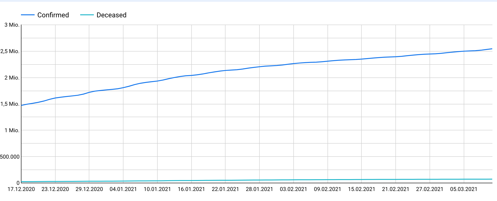
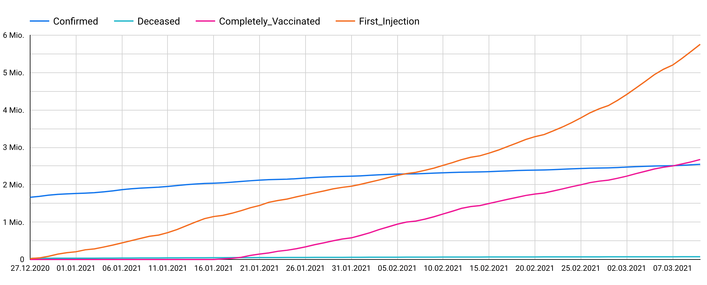

This weekend, I asked myself a simple question. Do the Covid  Vaccinations in Germany, have an impact on the number of deceased cases we are seeing in the data? A positive signal in the data, would be for me as a light at the end of the tunnel.

So I headed over to BigQuery and took a look at the public available Covid 19 Dataset. The dataset is the data available from JHU. It contains the number of confirmed, tested and deceased cases by date and country. Which is ideal for my use cases. With a simple query, we can bring that data onto a chart in Google Data Studio.
```SQL
SELECT
  date,
  SUM(cumulative_deceased) AS Deceased,
  SUM(cumulative_confirmed) AS Confirmed
  FROM `bigquery-public-data.covid19_open_data.covid19_open_data`
  WHERE country_code = 'DE' AND subregion1_code is null
  GROUP BY date
  ORDER BY date
```



But how about the number of vaccinations? They aren't included in the JHU data set as of now. The German government is providing the vaccination data on their Open Data platform GovData [link to data]. The data can is available in different formats (CSV, XLS, JSON). [GovData Corona Vaccinations Dataset]

So I decided to write a simple Google Dataflow job to ingest that data into  BigQuery. Of course, the amount of data doesn't need Dataflow or BigQuery, but for me, it was a good exercise in using both. And I like the query capabilities of BigQuery a lot. 
```Kotlin
import com.google.api.services.bigquery.model.TableFieldSchema
import com.google.api.services.bigquery.model.TableRow
import com.google.api.services.bigquery.model.TableSchema
import org.apache.beam.sdk.Pipeline
import org.apache.beam.sdk.io.TextIO
import org.apache.beam.sdk.io.gcp.bigquery.BigQueryIO
import org.apache.beam.sdk.options.PipelineOptions
import org.apache.beam.sdk.options.PipelineOptionsFactory
import org.apache.beam.sdk.options.ValueProvider
import org.apache.beam.sdk.transforms.Filter
import org.apache.beam.sdk.transforms.MapElements
import org.apache.beam.sdk.transforms.SimpleFunction
import org.apache.beam.sdk.values.TypeDescriptor
import java.util.*

// https://opendata.rhein-kreis-neuss.de/explore/dataset/deutschland-corona-impfungen/download/?format=csv

class CsvLineFormat : SimpleFunction<String, Array<String>>() {
  override fun apply(line: String): Array<String> {
    var lineElements = line.split(";")
    return arrayOf(lineElements[0],
      lineElements[1],lineElements[2],lineElements[3],lineElements[4],lineElements[5],
      lineElements[6],lineElements[7],lineElements[8],lineElements[9],lineElements[10],
      lineElements[11],lineElements[12],lineElements[13],lineElements[14],lineElements[15],
      lineElements[16],lineElements[17],lineElements[18],lineElements[19],lineElements[20],
      lineElements[21],lineElements[22],lineElements[23])
  }
}

public class Convert : SimpleFunction<Array<String>, TableRow>() {
  override fun apply(line: Array<String>): TableRow {
    var row = TableRow()
    row.set("date", line[0])
    row.set("dosen_kumulativ", line[1].toInt())
    row.set("dosen_differenz_zum_vortag", line[2].toInt())
    row.set("dosen_erst_differenz_zum_vortag", line[3].toInt())
    row.set("dosen_zweit_differenz_zum_vortag", line[4].toInt())
    row.set("dosen_biontech_kumulativ", line[5].toInt())
    row.set("dosen_moderna_kumulativ", line[6].toInt())
    row.set("dosen_astrazeneca_kumulativ", line[7].toInt())
    row.set("personen_erst_kumulativ", line[8].toInt())
    row.set("personen_voll_kumulativ", line[9].toInt())
    row.set("impf_quote_erst", line[10].toFloat())
    row.set("impf_quote_voll", line[11].toFloat())
    row.set("indikation_alter_dosen", line[12].toInt())
    row.set("indikation_beruf_dosen", line[13].toInt())
    row.set("indikation_medizinisch_dosen", line[14].toInt())
    row.set("indikation_pflegeheim_dosen", line[15].toInt())
    row.set("indikation_alter_erst", line[16].toInt())
    row.set("indikation_beruf_erst", line[17].toInt())
    row.set("indikation_medizinisch_erst", line[18].toInt())
    row.set("indikation_pflegeheim_erst", line[19].toInt())
    row.set("indikation_alter_voll", line[20].toInt())
    row.set("indikation_beruf_voll", line[21].toInt())
    row.set("indikation_medizinisch_voll", line[22].toInt())
    row.set("indikation_pflegeheim_voll", line[23].toInt())
    
    return row
  }
}

public class RemoveHeaderFilter : SimpleFunction<Array<String>, Boolean>() {
  override fun apply(it: Array<String>): Boolean {
    return it[0] != "date"
  }
}

inline fun <reified T: Any> clazz():TypeDescriptor<T> {
  return TypeDescriptor.of(T::class.java)
}

fun main(args: Array<String>) {
  val options = PipelineOptionsFactory
      .fromArgs(*args)
      .withValidation()
      .`as`(PipelineOptions::class.java)
  val p: Pipeline = Pipeline.create(options)
  var project = "<project_id>  "
  var dataset = "covid_vaccination_germany"
  var table = "vaccinations"
  var schema = TableSchema()
      .setFields(
          Arrays.asList(
              TableFieldSchema()
                  .setName("date")
                  .setType("DATETIME")
                  .setMode("REQUIRED"),
              TableFieldSchema()
                  .setName("dosen_kumulativ")
                  .setType("INT64")
                  .setMode("REQUIRED"),
              TableFieldSchema()
                  .setName("dosen_differenz_zum_vortag")
                  .setType("INT64")
                  .setMode("REQUIRED"),
              TableFieldSchema()
                  .setName("dosen_erst_differenz_zum_vortag")
                  .setType("INT64")
                  .setMode("REQUIRED"),
              TableFieldSchema()
                  .setName("dosen_zweit_differenz_zum_vortag")
                  .setType("INT64")
                  .setMode("REQUIRED"),
              TableFieldSchema()
                  .setName("dosen_biontech_kumulativ")
                  .setType("INT64")
                  .setMode("REQUIRED"),
              TableFieldSchema()
                  .setName("dosen_moderna_kumulativ")
                  .setType("INT64")
                  .setMode("REQUIRED"),
              TableFieldSchema()
                  .setName("dosen_astrazeneca_kumulativ")
                  .setType("INT64")
                  .setMode("REQUIRED"),
              TableFieldSchema()
                  .setName("personen_erst_kumulativ")
                  .setType("INT64")
                  .setMode("REQUIRED"),
              TableFieldSchema()
                  .setName("personen_voll_kumulativ")
                  .setType("INT64")
                  .setMode("REQUIRED"),
              TableFieldSchema()
                  .setName("impf_quote_erst")
                  .setType("FLOAT64")
                  .setMode("REQUIRED"),
              TableFieldSchema()
                  .setName("impf_quote_voll")
                  .setType("FLOAT64")
                  .setMode("REQUIRED"),
              TableFieldSchema()
                  .setName("indikation_alter_dosen")
                  .setType("INT64")
                  .setMode("REQUIRED"),
              TableFieldSchema()
                  .setName("indikation_beruf_dosen")
                  .setType("INT64")
                  .setMode("REQUIRED"),
              TableFieldSchema()
                  .setName("indikation_medizinisch_dosen")
                  .setType("INT64")
                  .setMode("REQUIRED"),
              TableFieldSchema()
                  .setName("indikation_pflegeheim_dosen")
                  .setType("INT64")
                  .setMode("REQUIRED"),
              TableFieldSchema()
                  .setName("indikation_alter_erst")
                  .setType("INT64")
                  .setMode("REQUIRED"),
              TableFieldSchema()
                  .setName("indikation_beruf_erst")
                  .setType("INT64")
                  .setMode("REQUIRED"),
              TableFieldSchema()
                  .setName("indikation_medizinisch_erst")
                  .setType("INT64")
                  .setMode("REQUIRED"),
              TableFieldSchema()
                  .setName("indikation_pflegeheim_erst")
                  .setType("INT64")
                  .setMode("REQUIRED"),
              TableFieldSchema()
                  .setName("indikation_alter_voll")
                  .setType("INT64")
                  .setMode("REQUIRED"),
              TableFieldSchema()
                  .setName("indikation_beruf_voll")
                  .setType("INT64")
                  .setMode("REQUIRED"),
              TableFieldSchema()
                  .setName("indikation_medizinisch_voll")
                  .setType("INT64")
                  .setMode("REQUIRED"),
              TableFieldSchema()
                  .setName("indikation_pflegeheim_voll")
                  .setType("INT64")
                  .setMode("REQUIRED")
          )
      )

  p.apply(TextIO.read().from("gs://<project_id>  -bucket/input.csv"))
    .apply("Split CSV", MapElements
      .into(TypeDescriptor.of(Array<String>::class.java))
      .via( CsvLineFormat() ))
    .apply("Filter Header", Filter.by( RemoveHeaderFilter() ))
    .apply("Convert Elements", MapElements
      .into(clazz<TableRow>())
      .via( Convert() ))
    .apply("Write to BigQuery", BigQueryIO.writeTableRows()
        .to(String.format("%s:%s.%s", project, dataset, table))
        .withSchema(schema)
        .withCustomGcsTempLocation(ValueProvider.StaticValueProvider.of("gs://<temp_bucket_id>/bigquerytemp"))
        .withCreateDisposition(BigQueryIO.Write.CreateDisposition.CREATE_IF_NEEDED)
        .withWriteDisposition(BigQueryIO.Write.WriteDisposition.WRITE_TRUNCATE)
    )
  p.run().waitUntilFinish()
}
```

Cloud Schedule triggers the job for us on a daily schedule. Cloud Schedule also downloads the latest CSV from GovData to our Cloud Storage, by triggering a Cloud Function for us.

This allows us to combine the two data sets in a single query. Which is pretty awesome, if you think about it. I own only one of the datasets but can use them both in my analysis.
```SQL
SELECT
  CAST(v.date AS DATE) AS Date,
  v.personen_erst_kumulativ AS First_Injection,
  v.personen_voll_kumulativ AS Completely_Vaccinated,
  c.Confirmed,
  c.Deceased
FROM
  `<project_id>  .covid_vaccination_germany.vaccinations` AS v
INNER JOIN (
  SELECT
  date,
  SUM(cumulative_deceased) AS Deceased,
  SUM(cumulative_confirmed) AS Confirmed
  FROM `bigquery-public-data.covid19_open_data.covid19_open_data`
  WHERE country_code = 'DE' AND subregion1_code is null
  GROUP BY date
  ORDER BY date ) AS c
ON
  CAST(v.date AS DATE) = c.date
ORDER BY
  v.date
```



[GovData Corona Vaccinations Dataset]: https://www.govdata.de/web/guest/suchen/-/details/deutschland-corona-impfungen
